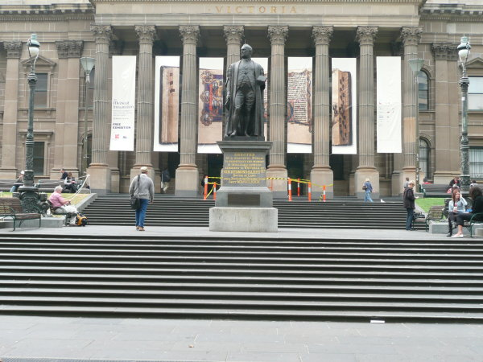
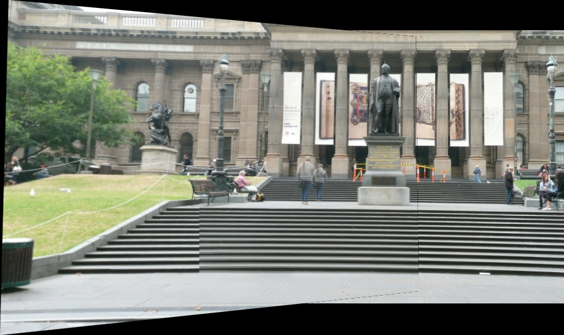

# Panorama Stitching Using Feature Matching & RANSAC

## 📖 Overview
This project implements **panorama image stitching** using:
- **Feature detection** (Harris, Shi-Tomasi, or SIFT)
- **Feature matching** (Sum of Squared Differences)
- **RANSAC-based Homography Estimation**
- **Cylindrical Projection** (for correcting lens distortion)
- **Image Warping & Blending** (for seamless stitching)

It takes multiple overlapping images and stitches them into a **single panoramic image**.

## 📷 Example
| Input Images | Stitched Panorama |
|-------------|------------------|
|   |  |

---

## ⚙️ Installation
1. **Clone this repository**
   ```sh
   git clone https://github.com/yourusername/Panorama-Stitching.git
   cd Panorama-Stitching
   ```

2. **Install dependencies**
   ```sh
   pip install -r requirements.txt
   ```
   *(Ensure `opencv-python`, `numpy`, `matplotlib`, and `scipy` are installed.)*

---

## 🚀 Usage
### **Step 1: Prepare Images**
- Place all images in the **`images/`** directory.
- Ensure the images have overlapping areas for stitching.

### **Step 2: Run the script**
```sh
python main.py
```
It will prompt you for:
- **Focal Length** (e.g., `1500`)
- **Number of Keypoints** (e.g., `5000`)
- **Detection Method** (`HARRIS`, `SHI-TOMASI`, or `SIFT`)
- **ANMS Keypoints** (e.g., `600`)

### **Step 3: Output**
- The stitched panorama is displayed and saved as `stitched_panorama.jpg`.

---

## 🛠️ Project Structure
```
📂 Panorama-Stitching
│── 📂 images/             # Folder for input images
│── 📜 main.py             # Main script
│── 📜 img_utils.py        # Image utilities (loading, visualization)
│── 📜 keypoints.py        # Keypoint detection & description
│── 📜 matching.py         # Feature matching & RANSAC
│── 📜 warp_blend.py       # Image warping & blending
│── 📜 test_pipeline.py    # Pipeline testing
│── 📜 requirements.txt    # Dependencies
│── 📜 README.md           # Project documentation
```

---

## 🔧 Troubleshooting
### 1️⃣ **"No valid homography found"**
✅ Try reducing **RANSAC threshold** in `matching.py`:
```python
def RANSAC(match_kp1, match_kp2, iter=2000, threshold=5)
```
✅ Reduce **keypoints (`N_Strong`)** to `5000`.

### 2️⃣ **Low feature matches**
✅ Increase **matching threshold** in `feature_matching()`:
```python
def feature_matching(desc1, desc2, threshold=0.5)
```

---

## 📌 Future Improvements
- Support for **multi-image** stitching.
- GPU acceleration with **CUDA-based OpenCV**.
- Improved **seamless blending** using Laplacian Pyramid.

---

## 📝 Author
👤 **Deven Shah** 
🔗 [GitHub](https://github.com/Dev584)

---
